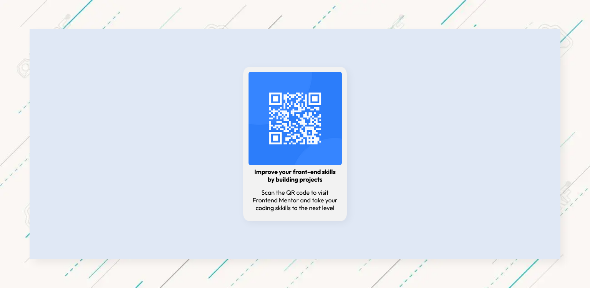

# Frontend Mentor - QR code component solution

This is a solution to the [QR code component challenge on Frontend Mentor](https://www.frontendmentor.io/challenges/qr-code-component-iux_sIO_H). Frontend Mentor challenges help you improve your coding skills by building realistic projects. 

## Table of contents

- [Overview](#overview)
  - [Screenshot](#screenshot)
  - [Links](#links)
- [My process](#my-process)
  - [Built with](#built-with)
  - [What I learned](#what-i-learned)
  - [Continued development](#continued-development)
  - [Useful resources](#useful-resources)
- [Author](#author)
- [Acknowledgments](#acknowledgments)

**Note: Delete this note and update the table of contents based on what sections you keep.**

## Overview

### Screenshot



### Links

- Solution URL: [Add solution URL here](https://your-solution-url.com)
- Live Site URL: [Add live site URL here](https://your-live-site-url.com)

## My process

### Built with

- HTML5 basic elements
- CSS

### What I learned

I just learned how to make a smooth shadow, the trick is to use a moderate blur and lowerning down the opacity of the shadow


```css
.container {
  box-shadow: 5px 5px 50px rgb(0, 0, 0, .6);
}
```

### Continued development

Gotta dig down the flexbox and shadow hole, not really feeling like using shadow or flexbox builder since it's not really learning and i want to master the basic first

### Useful resources

- [Neumorphism.io](https://neumorphism.io/#e0e0e0) - Didn't use this in this project, but I sometimes open it to see beautiful shadows

## Author

- Frontend Mentor - [@mfs_code](https://www.frontendmentor.io/profile/mfscode)
- Twitter - [@mfskb3](https://twitter.com/mfskb3)
- Instagram = [@mfs_arc](https://www.instagram.com/mfs_arc/)
